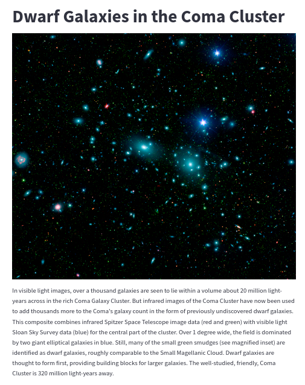
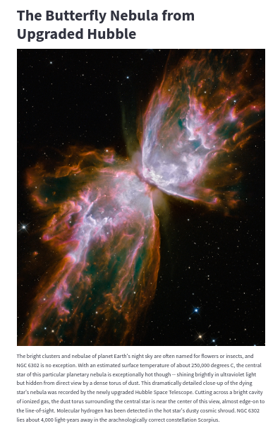

# NASA Image Viewer

This is a simple Python application that uses the NASA API to fetch and display an image of the day.
<p align="center">


</p>

## Requirements

- Python 3.6+
- `requests`
- `python-dotenv`
- `streamlit`

## Setup

1. Clone this repository.
2. Install the required packages using pip:

```bash
pip install -r requirements.txt
```

3. Create a `.env` file in the root directory and add your NASA API key:

```bash
API_KEY=your_nasa_api_key
```

## Running the Application

To run the application, use the following command:

```bash
streamlit run main.py
```

The application will start and be accessible at `http://localhost:8501`.

## How it works

The application uses the NASA API to fetch the image of the day along with its title and explanation. It then uses Streamlit to display this information in a web application.
